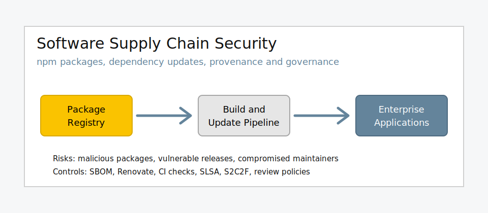

# Einleitung

TODO: Einleitung knapp halten. Dieses Kapitel soll Kontext, Problem, Ziel, Abgrenzung und Aufbau
beschreiben, aber noch keine Analyseergebnisse vorwegnehmen.

## Ausgangslage und Motivation

TODO: Kurz beschreiben, warum Open-Source-Abhängigkeiten und npm-Supply-Chain-Risiken für
Unternehmen relevant sind.

## Problemstellung

TODO: Problem aus dem Themenantrag verdichten: unsichere oder verspätete Updates einerseits,
Risiko kompromittierter neuer Releases andererseits.

## Ziel der Arbeit

TODO: Ziel der Arbeit in wenigen Sätzen beschreiben.

## Forschungsfrage

Wie können Unternehmen Sicherheitsrisiken durch Open-Source-Abhängigkeiten minimieren und
gleichzeitig effiziente, automatisierte Update-Prozesse gewährleisten?

## Abgrenzung

TODO: Scope festhalten: öffentliches npm-Ökosystem; keine vollständige Unternehmensimplementierung,
kein tiefes Malware Reverse Engineering, keine rechtliche Analyse.

## Aufbau der Arbeit

TODO: Nach Fertigstellung kurz beschreiben, was die folgenden Kapitel leisten.
